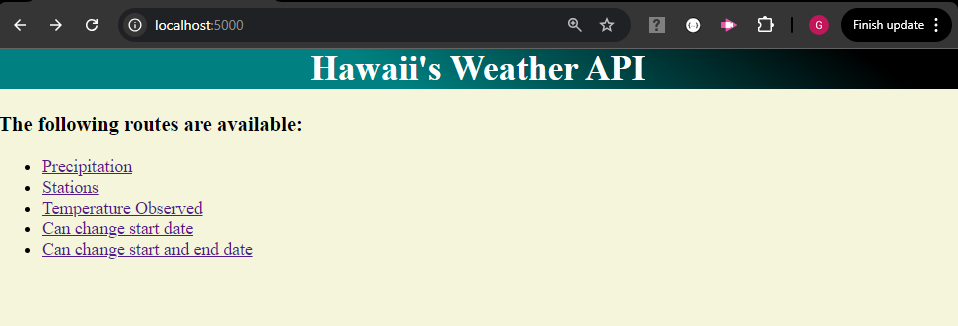

# SQLAchemy Weather API

## Website: 
[website](https://github.com/Damiomo/SQLAlchemy-Weather-API/tree/main)

## Description
Created weather api that provides climate history information from Hawaii.

## Table of Contents
- [Installation](#installation)
- [Usage](#usage)
- [Credits](#credits)
- [License](#license)
- [Features](#features)

- [Contact](#contact)

## Installation
sqlachemy, pandas, datetime, flask and python

## Usage
run the app.py file with python

## Credits
Damilare Omoboriowo

## License
MIT

## Features
It provides multiple links to climate history information from Hawaii.

## Contact
If there are any questions or concerns, I can be reached at:
##### [github: Damiomo](https://github.com/Damiomo)
##### [email: Domoboriowo14@Gmail.com](mailto:Domoboriowo14@Gmail.com)
